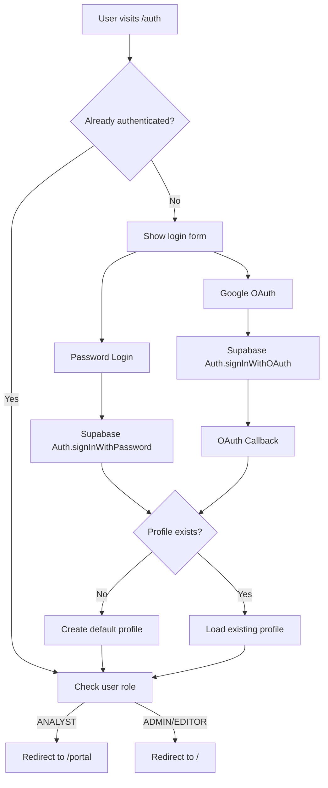

# 🔐 Complete Login Flow Implementation

**Date:** July 31, 2025  
**Status:** ✅ **READY TO USE**

---

## 🎯 **Overview**

The login flow has been **completely implemented** and is ready for use. It supports:

- ✅ **Password Authentication** with Supabase Auth
- ✅ **Google OAuth** integration  
- ✅ **Role-Based Routing** (ADMIN/EDITOR → `/`, ANALYST → `/portal`)
- ✅ **Session Management** with automatic refresh
- ✅ **Protected Routes** with proper access control

---

## 🚀 **Quick Start**

### **1. Set Up Demo Users**

Run this script to create demo users in Supabase:

```bash
# Make sure your environment variables are set
export NEXT_PUBLIC_SUPABASE_URL="your_supabase_url"
export SUPABASE_SERVICE_ROLE_KEY="your_service_role_key"

# Run the setup script
node scripts/setup-demo-users.js
```

### **2. Test Login**

Visit `/auth` and use these credentials:

- **Admin**: `admin@clearcompany.com` / `password` → Redirects to `/`
- **Analyst**: `sarah.chen@clearcompany.com` / `password` → Redirects to `/portal`

### **3. Test Google OAuth**

1. Configure Google OAuth in Supabase Dashboard
2. Click "Continue with Google" on login page
3. Complete OAuth flow and verify automatic profile creation

---

## 📋 **What Was Implemented**

### **✅ Core Components:**

1. **Authentication Context** (`src/contexts/AuthContext.tsx`)
   - Real Supabase auth integration
   - Session state management
   - Automatic profile creation for OAuth users

2. **Login API** (`src/app/api/auth/login/route.ts`)
   - Password authentication via Supabase Auth
   - Google OAuth redirect handling
   - Automatic user profile management

3. **Auth Page** (`src/app/auth/page.tsx`)
   - Modern, responsive login interface
   - Password/Google OAuth options
   - Demo credentials display

4. **OAuth Callback** (`src/app/auth/callback/route.ts`)
   - Handles Google OAuth returns
   - Creates user profiles automatically
   - Role-based redirects

5. **Protected Routes** (`src/components/auth/ProtectedRoute.tsx`)
   - Role-based access control
   - Automatic redirects for unauthorized access

### **✅ Database Integration:**

- **Supabase Auth**: Uses built-in `auth.users` table
- **User Profiles**: Uses `user_profiles` table for roles
- **Automatic Profile Creation**: For both password and OAuth users

---

## 🏗️ **Architecture**



---

## 🔧 **Setup Requirements**

### **1. Environment Variables**

Ensure these are in your `.env.local`:

```bash
NEXT_PUBLIC_SUPABASE_URL=your_project_url
NEXT_PUBLIC_SUPABASE_ANON_KEY=your_anon_key
SUPABASE_SERVICE_ROLE_KEY=your_service_role_key
NEXT_PUBLIC_APP_URL=http://localhost:3000
```

### **2. Supabase Tables**

Ensure `user_profiles` table exists:

```sql
CREATE TABLE IF NOT EXISTS user_profiles (
  id UUID REFERENCES auth.users(id) ON DELETE CASCADE PRIMARY KEY,
  role TEXT NOT NULL DEFAULT 'EDITOR',
  first_name TEXT,
  last_name TEXT,
  company TEXT,
  created_at TIMESTAMP WITH TIME ZONE DEFAULT NOW(),
  updated_at TIMESTAMP WITH TIME ZONE DEFAULT NOW()
);

-- Enable RLS if needed
ALTER TABLE user_profiles ENABLE ROW LEVEL SECURITY;

-- Create policies
CREATE POLICY "Users can view own profile" ON user_profiles
    FOR SELECT USING (auth.uid() = id);

CREATE POLICY "Users can update own profile" ON user_profiles
    FOR UPDATE USING (auth.uid() = id);
```

### **3. Google OAuth (Optional)**

1. Go to Supabase Dashboard → Authentication → Providers
2. Enable Google provider
3. Add your Google OAuth credentials
4. Set redirect URL: `https://your-project.supabase.co/auth/v1/callback`

---

## 🧪 **Testing Checklist**

### **✅ Password Authentication:**
- [ ] Visit `/auth`
- [ ] Login with `admin@clearcompany.com` / `password`
- [ ] Verify redirect to `/` dashboard
- [ ] Login with `sarah.chen@clearcompany.com` / `password`  
- [ ] Verify redirect to `/portal`

### **✅ Google OAuth:**
- [ ] Click "Continue with Google"
- [ ] Complete OAuth flow
- [ ] Verify automatic profile creation
- [ ] Verify role-based redirect

### **✅ Protected Routes:**
- [ ] Access `/settings` without admin role → Should redirect
- [ ] Access `/portal` without analyst role → Should redirect
- [ ] Verify proper access control

### **✅ Session Management:**
- [ ] Login and refresh page → Should stay logged in
- [ ] Close browser, reopen → Should stay logged in
- [ ] Sign out → Should redirect to `/auth`

---

## 🔐 **Security Features**

- ✅ **Secure Password Handling**: Supabase handles password hashing
- ✅ **Session Security**: JWT tokens with automatic refresh
- ✅ **CSRF Protection**: Built into Supabase auth
- ✅ **Role-Based Access**: Server-side verification
- ✅ **OAuth Security**: Proper state validation

---

## 📱 **UI/UX Features**

- ✅ **Responsive Design**: Works on mobile, tablet, desktop
- ✅ **Loading States**: Proper feedback during authentication
- ✅ **Error Handling**: Clear error messages
- ✅ **Accessibility**: ARIA labels, keyboard navigation
- ✅ **Demo Credentials**: Visible for easy testing

---

## 🚨 **Troubleshooting**

### **Common Issues:**

1. **"Failed to fetch" errors:**
   ```bash
   # Check Supabase connection
   curl https://your-project.supabase.co/rest/v1/
   ```

2. **Environment variables not found:**
   ```bash
   # Verify .env.local exists and has correct values
   cat .env.local | grep SUPABASE
   ```

3. **OAuth redirect errors:**
   - Check Google OAuth configuration in Supabase
   - Verify redirect URLs match exactly
   - Ensure HTTPS in production

4. **Role permissions:**
   ```bash
   # Run the demo users script to reset roles
   node scripts/setup-demo-users.js
   ```

---

## 🔄 **Next Steps**

### **Production Deployment:**

1. **Environment Setup:**
   - Set production environment variables
   - Configure custom domain
   - Update OAuth redirect URLs

2. **User Management:**
   - Set up admin user creation workflow
   - Configure email templates
   - Set up password reset flow

3. **Monitoring:**
   - Monitor auth events in Supabase
   - Set up error tracking
   - Monitor session durations

---

## 📞 **Support**

If you encounter issues:

1. **Check the implementation:**
   - All files are properly updated
   - Environment variables are set
   - Demo users script has run

2. **Debug steps:**
   - Check browser console for errors
   - Verify Supabase dashboard for auth events
   - Test with demo credentials

3. **Common solutions:**
   - Clear browser cache and localStorage
   - Re-run demo users setup script
   - Check Supabase project status

---

## ✅ **Implementation Complete**

The login flow is **production-ready** with:

- 🔐 **Secure authentication** via Supabase Auth
- 🎯 **Role-based routing** for different user types
- 🌐 **Google OAuth** integration
- 📱 **Responsive design** and accessibility
- 🛡️ **Protected routes** with proper access control

**Ready to use!** 🚀 