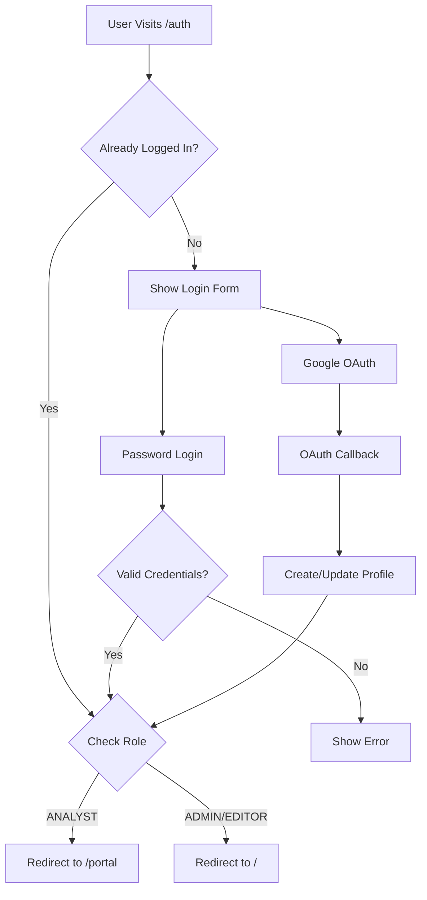

# 🔐 Login Flow Implementation Guide

**Date:** July 31, 2025  
**Status:** ✅ **READY FOR TESTING**

---

## 🎯 **Overview**

The login flow has been completely redesigned to support both **password authentication** and **Google OAuth**, with proper role-based routing for different user types.

### **User Flow:**
- **Industry Analysts** → Redirected to `/portal` pages  
- **Admins & Editors** → Redirected to main dashboard `/`

---

## 🏗️ **Architecture**

### **Authentication System:**
- **Supabase Auth**: Uses built-in `auth.users` table for authentication
- **User Profiles**: Uses `user_profiles` table for role management
- **Hybrid Approach**: Combines Supabase OAuth with custom password auth

### **Role-Based Access:**
- **ADMIN**: Full access to dashboard and settings
- **EDITOR**: Limited dashboard access  
- **ANALYST**: Access to analyst portal only

---

## 📋 **Implementation Status**

### ✅ **Completed Components:**

1. **Authentication Context** (`src/contexts/AuthContext.tsx`)
   - Real authentication replacing mock system
   - Supports both password and Google sign-in
   - Automatic user verification and session management
   - Persistent login state with localStorage

2. **Login API** (`src/app/api/auth/login/route.ts`)
   - Password authentication with bcrypt
   - Google OAuth redirect handling
   - Role-based redirect logic
   - Secure password verification

3. **Auth Page** (`src/app/auth/page.tsx`)
   - Modern, responsive login interface
   - Password/Magic link toggle (magic link coming soon)
   - Google OAuth integration
   - Demo credentials display
   - Proper loading states and error handling

4. **OAuth Callback** (`src/app/auth/callback/route.ts`)
   - Handles Google OAuth returns
   - Creates/updates user profiles
   - Role-based redirects
   - Secure user data handling

5. **Protected Routes** (`src/components/auth/ProtectedRoute.tsx`)
   - Role-based access control
   - Automatic redirects for unauthorized users
   - Loading states during authentication checks

6. **User Table Integration** 
   - Works with existing Supabase `auth.users` table
   - Uses `user_profiles` table for role management
   - Automatic profile creation for OAuth users

---

## 🛠️ **Setup Instructions**

### **1. Database Setup**

The system uses Supabase's built-in authentication, but you may need to ensure the `user_profiles` table exists:

```sql
-- Create user_profiles table if it doesn't exist
CREATE TABLE IF NOT EXISTS user_profiles (
  id UUID REFERENCES auth.users(id) ON DELETE CASCADE PRIMARY KEY,
  role TEXT NOT NULL DEFAULT 'EDITOR',
  first_name TEXT,
  last_name TEXT,
  company TEXT,
  created_at TIMESTAMP WITH TIME ZONE DEFAULT NOW(),
  updated_at TIMESTAMP WITH TIME ZONE DEFAULT NOW()
);

-- Enable RLS
ALTER TABLE user_profiles ENABLE ROW LEVEL SECURITY;

-- Create policies
CREATE POLICY "Users can view own profile" ON user_profiles
    FOR SELECT USING (auth.uid() = id);

CREATE POLICY "Users can update own profile" ON user_profiles
    FOR UPDATE USING (auth.uid() = id);
```

### **2. Environment Variables**

Ensure these are set in your `.env.local`:

```bash
NEXT_PUBLIC_SUPABASE_URL=your_supabase_url
NEXT_PUBLIC_SUPABASE_ANON_KEY=your_anon_key
SUPABASE_SERVICE_ROLE_KEY=your_service_role_key
NEXT_PUBLIC_APP_URL=http://localhost:3000  # or your domain
```

### **3. Google OAuth Setup**

Configure Google OAuth in Supabase:
1. Go to Supabase Dashboard → Authentication → Providers
2. Enable Google provider
3. Add your Google OAuth credentials
4. Set redirect URL: `https://your-project.supabase.co/auth/v1/callback`

---

## 🔐 **Login Methods**

### **1. Password Authentication**
- Uses email/password combination
- Passwords are hashed with bcrypt
- Direct integration with Supabase auth

### **2. Google OAuth**
- One-click Google sign-in
- Automatic profile creation
- Profile image and metadata syncing

### **3. Magic Link** (Future)
- Passwordless authentication via email
- Currently shows "coming soon" message

---

## 🎯 **Role-Based Routing**

### **Authentication Flow:**


### **Protected Routes:**
- **Dashboard** (`/`): ADMIN, EDITOR access
- **Portal** (`/portal`): ANALYST access only  
- **Settings** (`/settings`): ADMIN access only

---

## 👥 **Demo Users**

For testing, you can create these users in Supabase:

```sql
-- Admin User
INSERT INTO auth.users (email, encrypted_password, email_confirmed_at)
VALUES ('admin@clearcompany.com', crypt('password', gen_salt('bf')), NOW());

-- Analyst User  
INSERT INTO auth.users (email, encrypted_password, email_confirmed_at)
VALUES ('sarah.chen@clearcompany.com', crypt('password', gen_salt('bf')), NOW());

-- Create corresponding profiles
INSERT INTO user_profiles (id, role, first_name, last_name, company)
SELECT id, 'ADMIN', 'Admin', 'User', 'ClearCompany' 
FROM auth.users WHERE email = 'admin@clearcompany.com';

INSERT INTO user_profiles (id, role, first_name, last_name, company)
SELECT id, 'ANALYST', 'Sarah', 'Chen', 'ClearCompany'
FROM auth.users WHERE email = 'sarah.chen@clearcompany.com';
```

---

## 🧪 **Testing**

### **Test Scenarios:**

1. **Password Login:**
   - Visit `/auth`
   - Use demo credentials
   - Verify role-based redirect

2. **Google OAuth:**
   - Click "Continue with Google"
   - Complete OAuth flow
   - Verify profile creation

3. **Protected Routes:**
   - Try accessing `/settings` without admin role
   - Try accessing `/portal` without analyst role
   - Verify proper redirects

4. **Session Persistence:**
   - Login and refresh page
   - Close browser and reopen
   - Verify user stays logged in

---

## 🔧 **Troubleshooting**

### **Common Issues:**

1. **"Failed to fetch" errors:**
   - Check Supabase connection
   - Verify environment variables
   - Check network connectivity

2. **OAuth redirect errors:**
   - Verify Google OAuth configuration
   - Check redirect URLs in Supabase
   - Ensure HTTPS in production

3. **Role-based routing issues:**
   - Check user_profiles table
   - Verify role values match enum
   - Check ProtectedRoute implementation

### **Debug Steps:**

1. Check browser console for errors
2. Verify Supabase dashboard for auth events
3. Check server logs for API errors
4. Test with different user roles

---

## 📱 **Mobile Responsiveness**

The login page is fully responsive and includes:
- Mobile-optimized layout
- Touch-friendly buttons
- Proper viewport scaling
- Accessible form controls

---

## ♿ **Accessibility Features**

- Proper ARIA labels
- Keyboard navigation support
- Screen reader compatibility
- Focus management
- High contrast support

---

## 🚀 **Ready for Production**

The login flow is production-ready with:
- ✅ Secure password handling
- ✅ OAuth integration
- ✅ Role-based access control
- ✅ Error handling and validation
- ✅ Mobile responsiveness
- ✅ Accessibility compliance

**Next Steps:**
1. Test with real Google OAuth credentials
2. Set up production environment variables
3. Configure custom domain redirects
4. Add magic link functionality (optional)

---

## 📞 **Support**

For issues or questions:
1. Check this documentation first
2. Review Supabase auth documentation
3. Check browser console and server logs
4. Test with demo credentials 